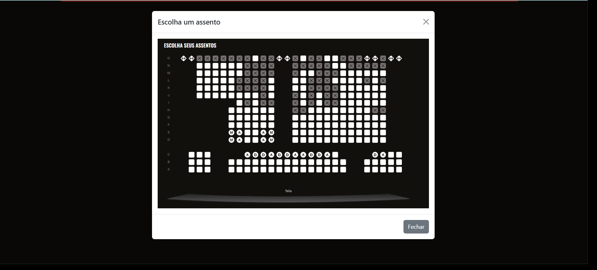

## Descrição

O SG-Cinema é um sistema de gerenciamento de cinema que permite a administração de clientes, filmes, sessões, ingressos e salas. Este projeto foi desenvolvido utilizando HTML, CSS, e JavaScript com o framework Bootstrap para criar uma interface responsiva e moderna.
Feito para a disciplina de tecnologia e construção de software.

## Funcionalidades

- **Cadastro de Clientes:** Permite adicionar novos clientes ao sistema.
- **Gerenciamento de Filmes:** Adicione e visualize filmes disponíveis.
- **Controle de Sessões:** Gerencie as sessões de filmes.
- **Venda de Ingressos:** Realize a compra de ingressos para sessões de filmes.
- **Administração de Salas:** Gerencie as salas de cinema.

## Estrutura do Projeto

A estrutura do projeto é organizada da seguinte maneira:


## Tecnologias Utilizadas

- **HTML5**: Estrutura básica do conteúdo.
- **CSS3**: Estilização do layout.
- **Bootstrap 5**: Framework CSS para design responsivo.
- **JavaScript**: Funcionalidades interativas.

## Como Executar o Projeto

1. **Clone o Repositório**

   ```bash
   git clone https://github.com/seu-usuario/sg-cinema.git
   ```

2. **Abra os Arquivos**

   Navegue até o diretório clonado e abra os arquivos HTML em um navegador web para visualizar o projeto.

3. **Modificações**

   Para fazer alterações no estilo, edite o arquivo `style.css`. Para modificar o comportamento, ajuste o código no arquivo `main.js`.

## Exemplos de Tela

Aqui estão alguns exemplos das telas do projeto:

### Tela Principal


### Tela de Compra de Ingressos




### APIs
https://developer.themoviedb.org/docs/getting-started

## Contribuição

Sinta-se à vontade para contribuir com o projeto enviando pull requests ou abrindo issues para melhorias e correções de bugs.

## Licença

Este projeto está licenciado sob a [Licença MIT](LICENSE).

## Contato

Para dúvidas ou sugestões, entre em contato com [Pedro Oliveira](mailto:pedropucmont@gmail.com).

